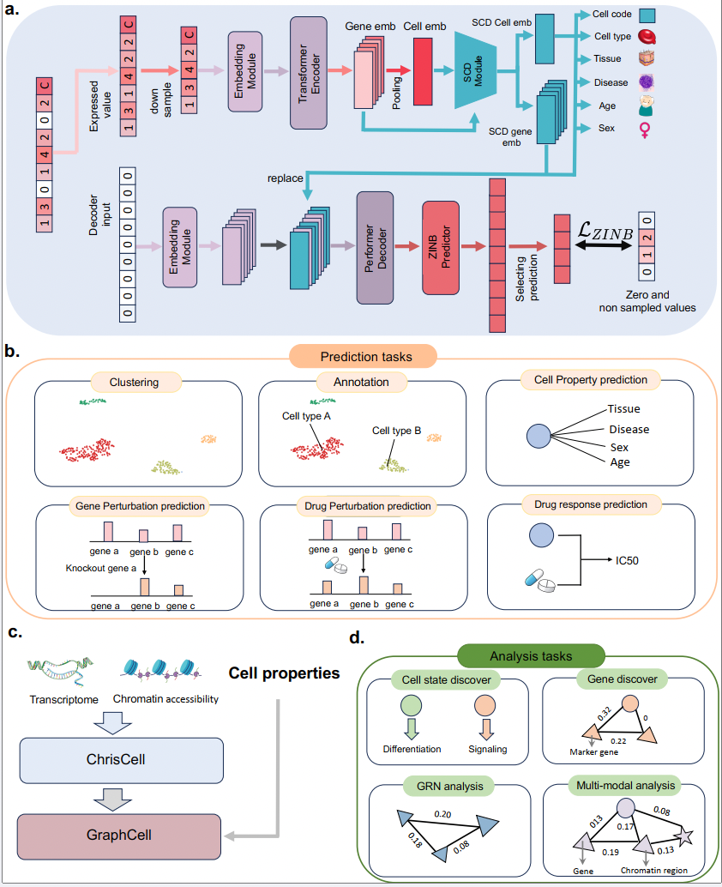

# [ChrisCell] Illuminating cell states by a comprehensive and interpretable single cell foundation model

ChrisCell is a comprehensive and interpretable single-cell foundation model. ChrisCell innovatively integrates a Single-Cell Discretization (SCD) module into the single-cell foundation model. This module utilizes a unified cell codebook to transform the cell representation into a cell code and uses an SCD cell embedding derived from the cell codebook to represent the cell corresponding to the code. ChrisCell employs an encoder-SCD-decoder architecture, encompassing 511 million parameters and pretrained on over 68 million single-cell data points.

<p align="center" width="100%">
  
</p>

## Table of Contents
- [Background](#background)
- [Features](#features)
- [Installation](#installation)
- [Quick Start](#quick-start)
- [Usage](#usage)
  - [Command-Line Arguments](#command-line-arguments)
  - [Running the Example](#running-the-example)
  - [Using Custom Data](#using-custom-data)
- [References](#references)
- [Contact](#contact)
- [License](#license)

## Background

Advances in high-throughput single-cell sequencing techniques have enabled AI-driven methods to harness extensive datasets, resulting in the emergence of robust single-cell foundation models that demonstrate exceptional representation capabilities across various downstream applications. However, current evidence suggests that the practical utility and generalizability of these foundation models are significantly constrained by the sparsity and heterogeneity of real-world data, as well as their limited interpretability. To truly enhance single-cell research and facilitate drug discovery, a foundation model must exhibit improved generalizability across diverse real-world data sources and provide clear interpretations for novel biological insights.


## Features

- **Advanced cell representation and Generalizability**: ChrisCell can be applied to a wide range of single-cell tasks,  categorized into prediction and analysis tasks. In the realm of prediction tasks, which encompass cell clustering, annotation, property prediction, gene and drug perturbation prediction, as well as drug response prediction, ChrisCell demonstrates significant advancements over other foundation model. 
- **Effective Quantization**: ChrisCell effectively represents high-dimensional and multi-modal single-cell data using a single token, minimizing information loss.
- **Interprebility**: The VQ and ChrisCell-graph module provides quantized stastics that help interpret the significance of each gene or property in relation to the cell state. It greatly empowers the analysis tasks. By integrating ChrisCell and ChrisCell-Graph, the models can be used in four distinct tasks: cell state discovery, gene discovery, gene regulatory network (GRN) analysis, and multimodal analysis.

For more details on the performance and benchmarking, please refer to our paper.

## Installation

To get started with ChrisCell, follow these steps:

1. **Clone the repository**:

   ```bash
   git clone https://github.com/A4Bio/ChrisCell.git
   cd ChrisCell
   ```

2. **Create and activate the conda environment**:

    ```bash
    conda create -n chriscell python=3.9.17
    conda activate chriscell
    ./install.sh
    ```

3. **Download the pretrained Model**:

    We provide a pretrained model for ChrisCell. [Download it here](https://drive.google.com/file/d/1ksikFnld6Lt7m2Joijc6Y3B0HNx10L06/view?usp=sharing) and place it in the pretrained_models directory. We also provide the test data in [Download it here](https://doi.org/10.6084/m9.figshare.28787489.v2).

4. **Download the pretraining dataset**:
   To download the pretraining dataset, users can refer to the [link.](https://github.com/bowang-lab/scGPT.git)


## Quick Start

To quickly try out ChrisCell using an example dataset, run the following command:

```
bash run_example.sh
```

This script runs the `inference.py` script with sample data provided in the `examples` folder. 

We also provide an example tutorial in `quick_start.ipynb`.

## Usage

### Command-line Arguments

The `inference.py` script supports several command-line arguments:

| Argument                 | Description                                             | Default                             |
|--------------------------|---------------------------------------------------------|-------------------------------------|
| `--data_path`            | Path to the dataset.                                    | None                                |
| `--model_path`           | Path to the pretrained model checkpoint.                | `pretrained_model/checkpoint.pt`    |
| `--save_path`          | Path to save the output of ChrisCell.                        | `example`                           |
| `--device`               | Device to run the model on (`cpu` or `cuda`).           | `cuda`                              |
| `--verbose`              | Enable verbose output for debugging.                    | Disabled                            |
| `--mode`              | Model mode.                    | m1                           |

### Running the Example

You can run the example directly from the command line:

```bash
python inference.py
```

### Using Custom Data

To use ChrisCell with your own data, you need to provide a scRNA-seq or scATAC-seq dataset. For example:

```bash
python inference.py --data_path /path/to/your/dataset --save_path /path/to/your/save/path  --mode m1 --device cuda
```


## References

For a complete description of the method, see:

```
TBD
```

## Contact

Please submit any bug reports, feature requests, or general usage feedback as a github issue or discussion.

- Jue Wang (wangjue@westlake.edu.cn)
- Cheng Tan (tancheng@westlake.edu.cn)
- Zhangyang Gao (gaozhangyang@westlake.edu.cn)

## License

This project is licensed under the MIT License. 

